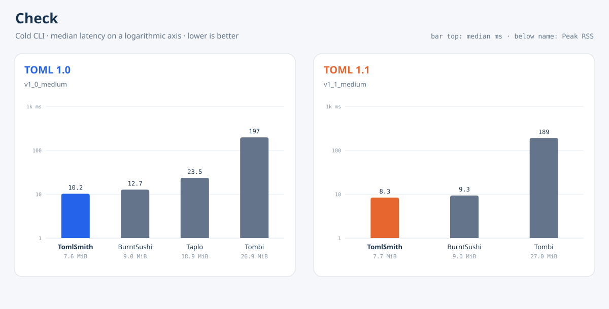
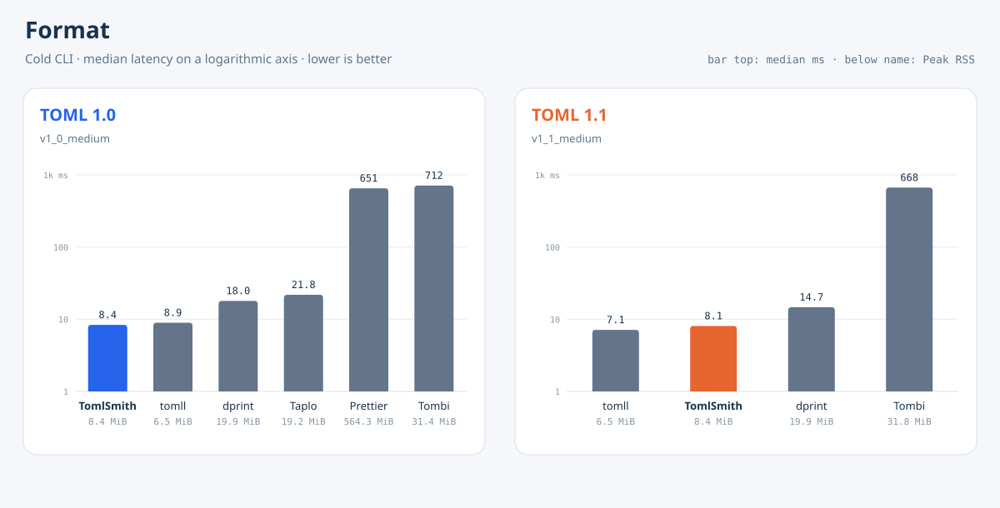

# TomlSmith Benchmark

**English** | [简体中文](README.zh-Hans.md)

[](https://github.com/tomlsmith/benchmark/actions/workflows/ci.yml) [](LICENSE)

TomlSmith Benchmark measures end-to-end cold-start latency, throughput, and peak memory for TOML checking and formatting CLIs. Each sample runs the product command in a new process instead of calling a parser library directly.

<!-- BENCHMARK_RESULTS_START -->
## Check

The check scenario uses deterministic synthetic documents covering the published TOML 1.0.0 and TOML 1.1.0 grammars. Only product/version pairs that accept the document under the selected version are shown.

<table>
<tr>
<td valign="top">

**TOML 1.0 · `v1_0_medium`**

| Product | Median (ms) | MiB/s | Peak RSS (MiB) |
| --- | ---: | ---: | ---: |
| TomlSmith native CLI | 10.21🥇 | 12.25🥇 | 7.64🥇 |
| BurntSushi/toml `tomlv` | 12.67🥈 | 9.88🥈 | 9.02🥈 |
| Taplo CLI | 23.46🥉 | 5.33🥉 | 18.92🥉 |
| Tombi | 196.54 | 0.64 | 26.88 |

</td>
<td valign="top">

**TOML 1.1 · `v1_1_medium`**

| Product | Median (ms) | MiB/s | Peak RSS (MiB) |
| --- | ---: | ---: | ---: |
| TomlSmith native CLI | 8.34🥇 | 15.01🥇 | 7.73🥇 |
| BurntSushi/toml `tomlv` | 9.31🥈 | 13.45🥈 | 9.02🥈 |
| Tombi | 189.41🥉 | 0.66🥉 | 27.02🥉 |

</td>
</tr>
</table>



## Format

The format scenario uses the same documents in an intentionally edited layout. A result is included only when the output reparses under the selected version, preserves decoded content, and is unchanged by a second format pass.

<table>
<tr>
<td valign="top">

**TOML 1.0 · `v1_0_medium`**

| Product | Median (ms) | MiB/s | Peak RSS (MiB) |
| --- | ---: | ---: | ---: |
| TomlSmith native CLI | 8.36🥇 | 14.97🥇 | 8.38🥈 |
| pelletier/go-toml `tomll`* | 8.94🥈 | 13.99🥈 | 6.50🥇 |
| dprint + TOML plugin | 17.96🥉 | 6.97🥉 | 19.89 |
| Taplo CLI | 21.82 | 5.73 | 19.16🥉 |
| Prettier + prettier-plugin-toml | 651.33 | 0.19 | 564.28 |
| Tombi | 712.21 | 0.18 | 31.39 |

</td>
<td valign="top">

**TOML 1.1 · `v1_1_medium`**

| Product | Median (ms) | MiB/s | Peak RSS (MiB) |
| --- | ---: | ---: | ---: |
| pelletier/go-toml `tomll`* | 7.12🥇 | 17.57🥇 | 6.50🥇 |
| TomlSmith native CLI | 8.08🥈 | 15.50🥈 | 8.42🥈 |
| dprint + TOML plugin | 14.66🥉 | 8.54🥉 | 19.88🥉 |
| Tombi | 667.66 | 0.19 | 31.80 |

</td>
</tr>
</table>



\* The correctness check compares decoded TOML content, not comments or layout. `tomll` reparses and writes the data, discarding comments and changing literal styles. The other formatters preserve comments, so these rows do not represent identical work.

These are the same four canonical results published on [tomlsmith.github.io](https://tomlsmith.github.io/). Git stores only the generated tables and charts. Raw run directories and archives are intentionally ignored; if they need to be distributed, publish them as checksummed GitHub Release assets rather than source files.
<!-- BENCHMARK_RESULTS_END -->

## Run locally

Install the exact published TomlSmith native CLI and the pinned competitor CLIs (prerequisites are in [CONTRIBUTING.md](CONTRIBUTING.md)):

```bash
./scripts/setup-products.sh
```

Run any exact lane, for example:

```bash
TOMLSMITH_BENCH_FILTER=e2e/check/cold-stdin/1.0/v1_0_medium \
  ./scripts/run-bench.sh local-check-v1_0

TOMLSMITH_BENCH_FILTER=e2e/check/cold-stdin/1.1/v1_1_medium \
  ./scripts/run-bench.sh local-check-v1_1

TOMLSMITH_BENCH_FILTER=e2e/format/cold-stdin/1.0/v1_0_medium \
  ./scripts/run-bench.sh local-format-v1_0

TOMLSMITH_BENCH_FILTER=e2e/format/cold-stdin/1.1/v1_1_medium \
  ./scripts/run-bench.sh local-format-v1_1
```

The manually dispatched `Benchmark` workflow accepts a `tomlsmith_ref` input to build the TomlSmith CLI from any git ref of the core repository before running the selected lanes. A locally built TomlSmith executable can be measured by exporting `TOMLSMITH_BIN` with `TOMLSMITH_BIN_EXPECTED_VERSION=any` (or an explicit version string) to relax the exact release pin, and `TOMLSMITH_BENCH_SKIP_PEAK_RSS=1` skips the peak-RSS pass on hosts without GNU `time`; published lanes leave both unset. Every timed sample starts a fresh process and reads the document from stdin; Peak RSS is the median of three separate fresh runs. Summarize any result directory with `scripts/summarize-results.py` and regenerate the charts with `scripts/generate-result-charts.py`.

Correctness, preflight, and resource-sampling process trees are bounded by `TOMLSMITH_BENCH_PROCESS_TIMEOUT_SECS` (120 seconds by default). The cross-product gate covers the four canonical medium-fixture publication lanes, while every other selected lane—including large and stress fixtures—must pass its own bounded preflight before timing. Timed iterations use the direct spawn path after that preflight so containment overhead is not counted as product latency. See the complete [measurement methodology](docs/methodology.md).

Run the pull-request gate with:

```bash
./scripts/check.sh
```

Before publishing measurements, run the cross-product correctness gate for all four canonical publication lanes with `./scripts/check-products.sh`; any additional lane is verified again against its exact fixture by the benchmark runner. Scheduled and on-demand benchmark workflows upload complete result directories as temporary GitHub Actions artifacts. Raw directories and archives stay out of Git; a maintainer can promote an archive and its checksum to a GitHub Release when long-lived public evidence is needed.

## Contributing

Read [CONTRIBUTING.md](CONTRIBUTING.md) before opening a pull request. Participation is governed by the organization-wide [Code of Conduct](https://github.com/tomlsmith/tomlsmith/blob/main/CODE_OF_CONDUCT.md).

## License

MIT. See [LICENSE](LICENSE).
