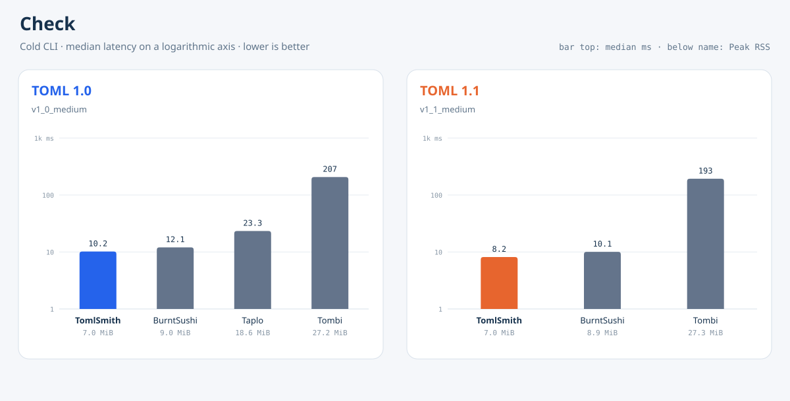
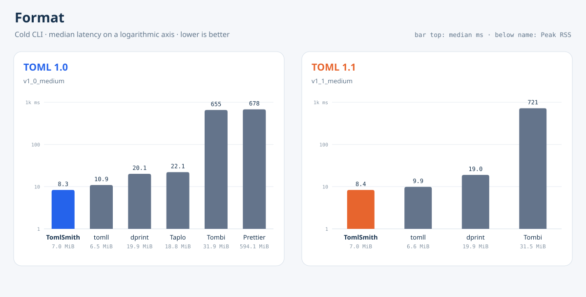

# TomlSmith Benchmark

[English](README.md) | **简体中文**

[](https://github.com/tomlsmith/benchmark/actions/workflows/ci.yml) [](LICENSE)

TomlSmith Benchmark 测量 TOML 检查与格式化 CLI 的端到端冷启动延迟、吞吐量和峰值内存。每个样本都会新起一个进程运行产品命令，不直接调用解析器库。

<!-- BENCHMARK_RESULTS_START -->
## Check

Check 场景使用确定性生成的合成文档，覆盖已发布的 TOML 1.0.0 与 TOML 1.1.0 语法。表格只展示能够按所选版本接受文档的产品与版本组合。

<table>
<tr>
<td valign="top">

**TOML 1.0 · `v1_0_medium`**

| 产品 | 中位延迟（ms） | MiB/s | Peak RSS（MiB） |
| --- | ---: | ---: | ---: |
| TomlSmith 原生 CLI | 10.21🥇 | 12.26🥇 | 6.98🥇 |
| BurntSushi/toml `tomlv` | 12.07🥈 | 10.37🥈 | 8.97🥈 |
| Taplo CLI | 23.34🥉 | 5.36🥉 | 18.59🥉 |
| Tombi | 206.80 | 0.61 | 27.25 |

</td>
<td valign="top">

**TOML 1.1 · `v1_1_medium`**

| 产品 | 中位延迟（ms） | MiB/s | Peak RSS（MiB） |
| --- | ---: | ---: | ---: |
| TomlSmith 原生 CLI | 8.17🥇 | 15.33🥇 | 6.95🥇 |
| BurntSushi/toml `tomlv` | 10.07🥈 | 12.43🥈 | 8.89🥈 |
| Tombi | 193.31🥉 | 0.65🥉 | 27.28🥉 |

</td>
</tr>
</table>



## Format

Format 场景使用相同文档，并采用刻意保留编辑痕迹的排版。只有输出能够按所选版本重新解析、保持解码内容不变且第二次格式化结果不变的产品才会进入表格。

<table>
<tr>
<td valign="top">

**TOML 1.0 · `v1_0_medium`**

| 产品 | 中位延迟（ms） | MiB/s | Peak RSS（MiB） |
| --- | ---: | ---: | ---: |
| TomlSmith 原生 CLI | 8.35🥇 | 14.99🥇 | 6.95🥈 |
| pelletier/go-toml `tomll`* | 10.91🥈 | 11.47🥈 | 6.45🥇 |
| dprint + TOML plugin | 20.12🥉 | 6.22🥉 | 19.94 |
| Taplo CLI | 22.07 | 5.67 | 18.77🥉 |
| Tombi | 655.14 | 0.19 | 31.86 |
| Prettier + prettier-plugin-toml | 678.41 | 0.18 | 594.09 |

</td>
<td valign="top">

**TOML 1.1 · `v1_1_medium`**

| 产品 | 中位延迟（ms） | MiB/s | Peak RSS（MiB） |
| --- | ---: | ---: | ---: |
| TomlSmith 原生 CLI | 8.36🥇 | 14.97🥇 | 7.02🥈 |
| pelletier/go-toml `tomll`* | 9.87🥈 | 12.68🥈 | 6.56🥇 |
| dprint + TOML plugin | 18.99🥉 | 6.59🥉 | 19.94🥉 |
| Tombi | 721.46 | 0.17 | 31.55 |

</td>
</tr>
</table>



\* 正确性检查比较解码后的 TOML 内容，不比较注释与排版。`tomll` 会重新解析并写出数据，同时丢弃注释、改变字面量写法；其他格式化器会保留注释，因此这些行完成的工作并不完全相同。

这四条标准赛道与 [tomlsmith.github.io](https://tomlsmith.github.io/) 展示的是同一份数据。Git 只保存生成后的表格与图表；原始运行目录和归档包明确忽略。需要分发时，应将它们作为带校验和的 GitHub Release 资产发布，而不是提交到源码历史。
<!-- BENCHMARK_RESULTS_END -->

## 本地运行

安装正式发布的精确版本 TomlSmith 原生 CLI 与固定版本的参测 CLI（前置依赖见 [CONTRIBUTING.md](CONTRIBUTING.md)）：

```bash
./scripts/setup-products.sh
```

执行任意一条赛道，例如：

```bash
TOMLSMITH_BENCH_FILTER=e2e/check/cold-stdin/1.0/v1_0_medium \
  ./scripts/run-bench.sh local-check-v1_0

TOMLSMITH_BENCH_FILTER=e2e/check/cold-stdin/1.1/v1_1_medium \
  ./scripts/run-bench.sh local-check-v1_1

TOMLSMITH_BENCH_FILTER=e2e/format/cold-stdin/1.0/v1_0_medium \
  ./scripts/run-bench.sh local-format-v1_0

TOMLSMITH_BENCH_FILTER=e2e/format/cold-stdin/1.1/v1_1_medium \
  ./scripts/run-bench.sh local-format-v1_1
```

每个计时样本都会启动一个新进程，并通过 stdin 读取文档；Peak RSS 为三个独立新进程结果的中位数。任意结果目录都可以用 `scripts/summarize-results.py` 生成汇总表，并用 `scripts/generate-result-charts.py` 重新生成图表。

正确性、preflight 与资源采样进程树受 `TOMLSMITH_BENCH_PROCESS_TIMEOUT_SECS` 限制（默认 120 秒）。跨产品门禁覆盖四条标准的 medium fixture 发布赛道；任何其他选定赛道（包括 large 与 stress fixture）都必须在计时前独立通过有界 preflight。计时迭代随后使用直接 spawn 路径，避免把 containment 开销算进产品延迟。完整契约见[测量方法](docs/methodology.md)。

执行 Pull Request 门禁：

```bash
./scripts/check.sh
```

发布测量结果前，还要用 `./scripts/check-products.sh` 对四条标准发布赛道运行跨产品正确性门禁；任何额外赛道都会由 benchmark runner 针对其精确 fixture 再次验证。定时和手动 benchmark 工作流会把完整结果目录上传为有保留期的 GitHub Actions artifact。原始目录和归档包不进入 Git；需要长期公开证据时，维护者可将归档包及其校验和提升为 GitHub Release 资产。

## 参与贡献

提交 Pull Request 前请阅读 [CONTRIBUTING.md](CONTRIBUTING.md)。参与项目需要遵守组织统一的 [行为准则](https://github.com/tomlsmith/tomlsmith/blob/main/CODE_OF_CONDUCT.md)。

## 许可

项目采用 MIT 许可，详见 [LICENSE](LICENSE)。
